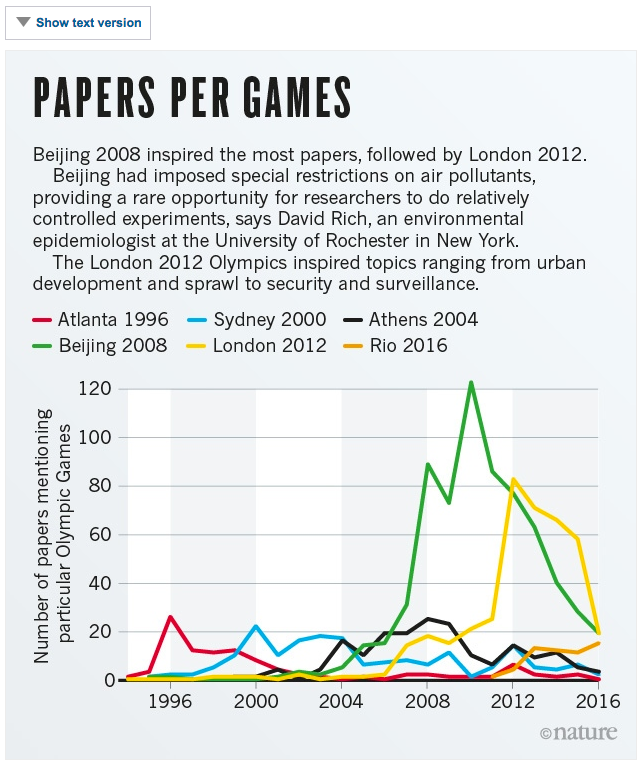

# Adds a 'Show text button' for Nature infographics

## How to:

Copy the contents of **index.html** into a new widget and paste this widget into the article - normally at the end of the article.

Within the article add the text that you would like to include before the image - normally the headline and standfirst from the image.

Open the source editor and add the class ``.js-hide-visually`` to the first text element you wish to hide before each image. The resulting html should look like this:

	<h2 class="js-hide-visually">Headline</h2>
	
Standfirst.

	
<a data-contentid="12.345678" data-style="middle" href="/polopoly/CM/12.345678">infographic.jpg - middle aligned</a>
